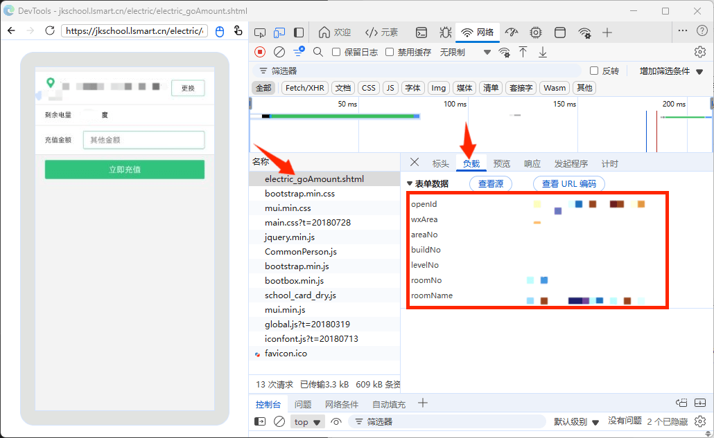

# 微信网页抓包调试指南

## 所需工具
- 一部手机
- 一台电脑
- 一条数据线

## 链接步骤

1.用数据线连接手机与电脑

2.手机打开 USB 调试

3.微信发送调试链接。
- 随便打开一个聊天窗口，输入并发送：http://debugxweb.qq.com/?inspector=true
- 点击打开该链接，弹出“执行成功”即可

4.微信打开需要抓包调试的网页（对于本项目而言为电费充值页面，如图）

5.电脑端打开浏览器
- Chrome 浏览器输入：chrome://inspect/#devices
- Edge 浏览器输入：edge://inspect/#devices

如果以上操作无误，您应当看到以下图片中的界面：下方为您的设备和您设备上打开的网页
到此，你就可以像在电脑浏览器的开发者工具中一样调试该网页

# 抓包步骤
对于本项目而言，您需要对“电费充值”相关的网页进行调试

1.找到“电费充值”网页并点击inspect进入调试

2.在打开的DevTools页面中找到网络选项卡，并点击重新加载页面

3.找到electric_goAmount.shtml并单击打开，找到负载选项卡，即可获得数据

# 最后
将抓包获得的数据对应填入到代码中即可（多余的数据无需填写）
